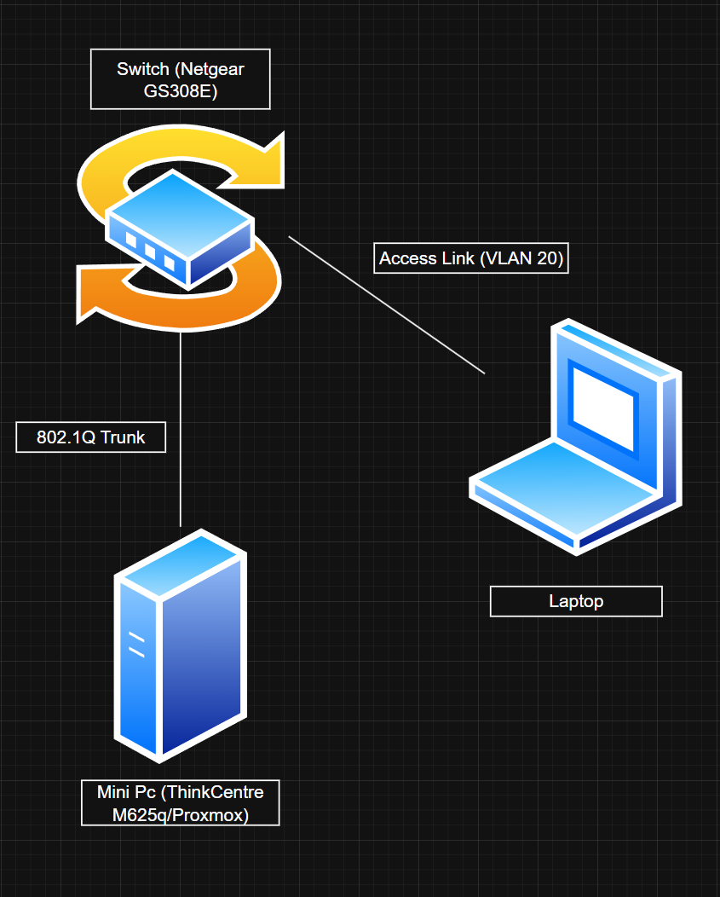

# Home Network Lab — Proxmox / pfSense / Managed Switch

## Overview
Built a physical and virtualized home network lab to gain hands-on experience with real-world networking concepts including network segmentation, firewall management, and infrastructure troubleshooting.

## Hardware Used
- Mini PC running Proxmox hypervisor
- Managed switch
- Various endpoint devices

## Software & Tools
- Proxmox VE — hypervisor and virtual machine management
- pfSense — firewall, routing, and DHCP management
- VLANs and trunking configured via managed switch

## What I Built & Configured
- Deployed multiple virtual machines across segmented VLANs

- Configured pfSense firewall rules to control inter-VLAN traffic
- Set up DHCP scopes per VLAN for automatic IP assignment
- Implemented trunking between switch and pfSense for VLAN routing
- Diagnosed and resolved real connectivity issues across the environment

## What I Learned
Gained practical understanding of how enterprise networks are structured, how traffic flows between segments, and how firewalls enforce security policies at the network level. This directly maps to concepts tested in CompTIA Security+ and foundational cloud networking in Azure and AWS.
